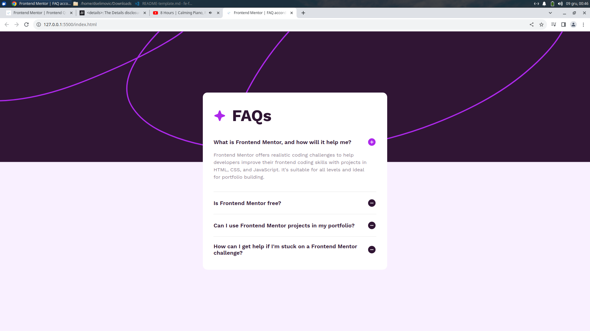

# Frontend Mentor - FAQ accordion solution

This is a solution to the [FAQ accordion challenge on Frontend Mentor](https://www.frontendmentor.io/challenges/faq-accordion-wyfFdeBwBz). Frontend Mentor challenges help you improve your coding skills by building realistic projects. 

## Table of contents

- [Overview](#overview)
  - [The challenge](#the-challenge)
  - [Screenshot](#screenshot)
  - [Links](#links)
- [My process](#my-process)
  - [Built with](#built-with)
  - [What I learned](#what-i-learned)
  - [Useful resources](#useful-resources)
- [Author](#author)
- [Acknowledgments](#acknowledgments)

**Note: Delete this note and update the table of contents based on what sections you keep.**

## Overview

### The challenge

Users should be able to:

- Hide/Show the answer to a question when the question is clicked
- Navigate the questions and hide/show answers using keyboard navigation alone
- View the optimal layout for the interface depending on their device's screen size
- See hover and focus states for all interactive elements on the page

### Screenshot

### Links

- Solution URL: [https://github.com/dselimovic02/fe-faq](https://your-solution-url.com)
- Live Site URL: [https://dselimovic02.github.io/fe-faq](https://your-live-site-url.com)

## My process

### Built with

- Semantic HTML5 markup
- CSS custom properties
- Flexbox
- JavaScript

### What I learned

In this project I have discovered the details HTML element. I really like how it behaves and is structured.

### Useful resources

- [Example resource 1](https://www.frontendmentor.io/challenges/frontend-quiz-app-BE7xkzXQnU) - The design on the bottom of the page introduced me to details element.
- [Example resource 2](https://developer.mozilla.org/en-US/docs/Web/HTML/Element/details) - This is an amazing article which helped me finally understand details element. I'd recommend it to anyone still learning this concept.
## Author

- Website - [Denis Selimovic](https://github.com/dselimovic02)
- Frontend Mentor - [@dselimovic02](https://www.frontendmentor.io/profile/dselimovic02)